# Running NCCL Tests Using the Run:ai CLI

This tutorial shows how to validate GPU and network communication on a 4-GPU-per-node GB200 cluster by running NCCL `all_reduce_perf_mpi` from containers launched with the Run:ai CLI.

You will run three checks:

- 1 node x 4 GPUs
- 2 nodes x 4 GPUs per node, for 8 total GPUs
- 3 nodes x 4 GPUs per node, for 12 total GPUs, ideally spanning racks

The screenshots are example chunks from an existing Run:ai environment. Use the command blocks as the generic workflow for a new environment.

## Prerequisites

- Run:ai is deployed and reachable through the Run:ai UI.
- You have a Run:ai user with access to the target project.
- The Run:ai CLI is installed or you can download it from the Run:ai UI.
- You have access to a project with enough quota for the largest test, for example 12 GPUs for three GB200 nodes.
- Your container image includes:
  - NVIDIA drivers exposed by the cluster runtime
  - CUDA and NCCL
  - MPI and NCCL tests, including `/usr/local/bin/all_reduce_perf_mpi`
  - For multi-node tests, MPI launch support between pods, such as SSH or the site-approved MPI/PMIx setup
- Optional but recommended: `kubectl` access to the project namespace so you can inspect pod placement and rack labels.

Set these values before running the tutorial:

```bash
export PROJECT="nccl-benchmarking"
export NODE_POOL="default"
export NCCL_IMAGE="nvcr.io/nvidia/pytorch:26.01-py3"
export NCCL_TEST_BIN="/usr/local/bin/all_reduce_perf_mpi"
export RUNAI_URL="https://<your-runai-url>"
```

If your image uses a different NCCL test path, exec into the container and run:

```bash
which all_reduce_perf_mpi
```

## 1. Open the Run:ai UI and Get CLI Access

In the Run:ai UI, open the help menu and select **Researcher Command Line Interface**.

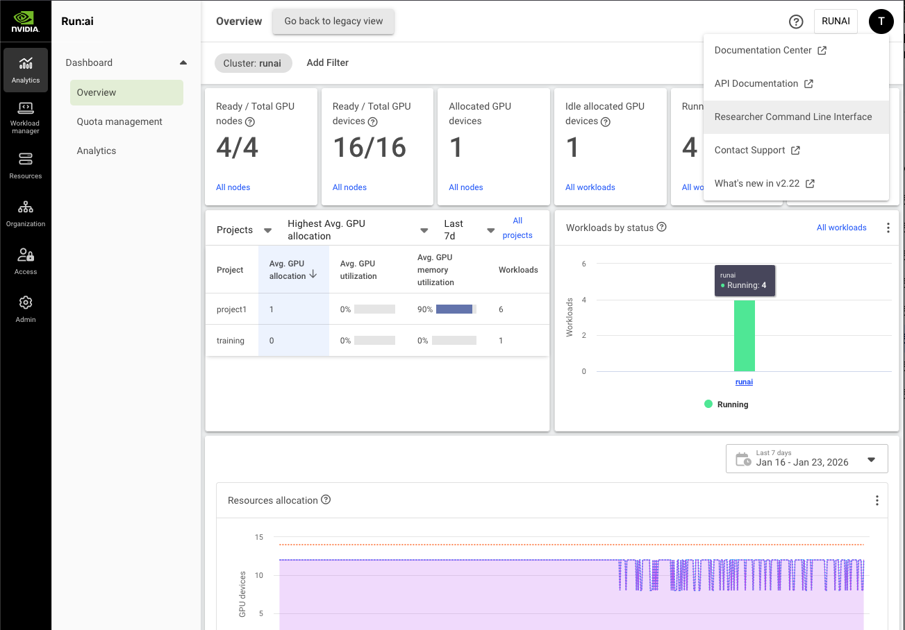

Choose the cluster and operating system, then copy the generated CLI install command.

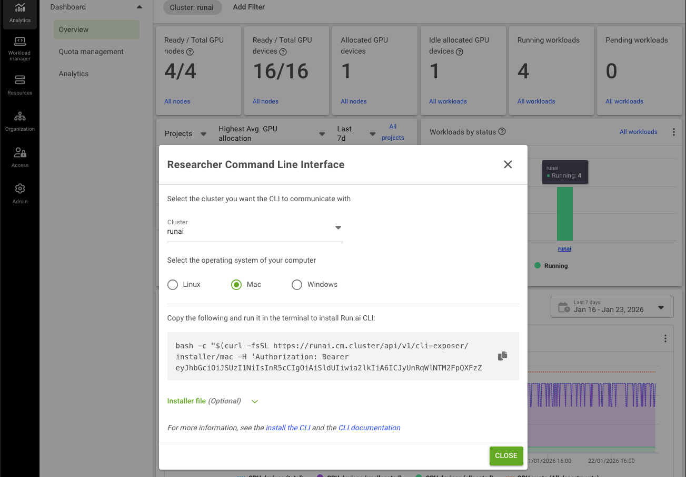

Run the copied command on your workstation or jump host.

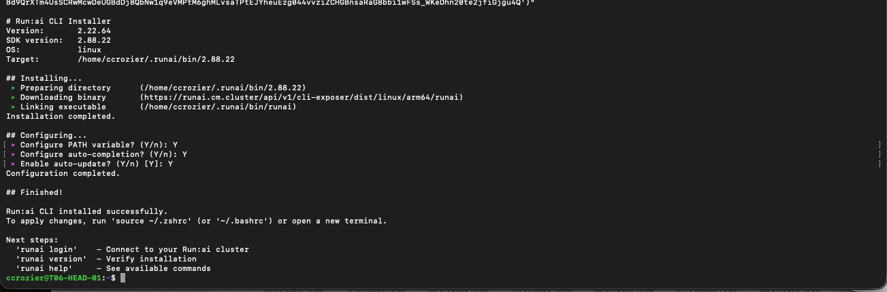

Log in to the control plane:

```bash
runai login
```

For a remote shell without browser forwarding, use:

```bash
runai login remote-browser
```

Follow the printed URL in a browser, authenticate, then paste the returned code into the terminal.

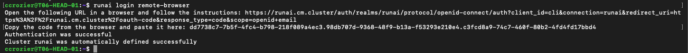

If your environment requires Kubernetes access through the Run:ai kubeconfig, refresh the token:

```bash
runai kubeconfig set
kubectl get nodes
```

## 2. Select the Project and Inspect Nodes

List the projects you can access and set the benchmarking project:

```bash
runai project list
runai project set "$PROJECT"
```

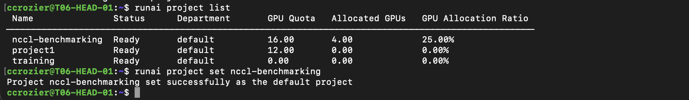

In the UI, go to **Resources > Nodes** to inspect GPU nodes, GPU type, free GPUs, and node pool.

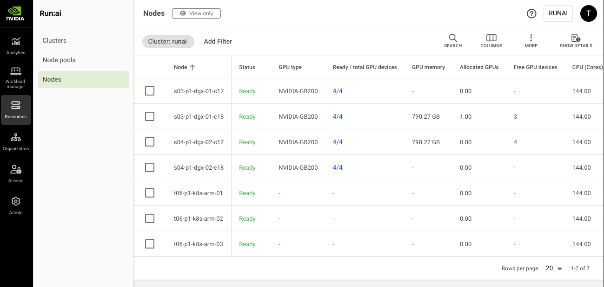

The CLI equivalent is:

```bash
runai node list
runai nodepool list
```

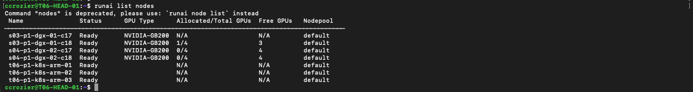

If rack placement matters, inspect node names or rack labels. In many environments, node names or labels identify the rack, for example `s03` and `s04`.

```bash
kubectl get nodes -L topology.kubernetes.io/zone -L topology.kubernetes.io/rack
kubectl get node <node-name> --show-labels
```

If your cluster does not expose rack labels, use the naming convention or ask the cluster administrator which node pools or scheduling rules map to racks.

## 3. Map UI, CLI, and API Actions

| Workflow action | Run:ai UI location | Run:ai CLI | REST API mapping |
| --- | --- | --- | --- |
| Get CLI access | Help menu > Researcher Command Line Interface | `runai login` | `POST /api/v1/token` for service-account automation |
| Select project | Organization > Projects | `runai project list`, `runai project set` | `GET /api/v1/org-unit/projects` |
| Inspect nodes | Resources > Nodes | `runai node list` | `GET /api/v1/nodes` |
| Create 1-node container | Workload manager > Workloads > New inference workload | `runai inference submit` | `POST /api/v1/workloads/inferences` |
| Create multi-node container group | Workload manager > Workloads > New distributed inference workload | `runai inference distributed submit` | `POST /api/v1/workloads/distributed-inferences` |
| Monitor workload | Workload details pane | `runai inference describe`, `runai inference logs` | `GET /api/v1/workloads/inferences/{workloadId}` |
| Delete workload | Workload actions > Delete | `runai inference delete` | `DELETE /api/v1/workloads/inferences/{workloadId}` |

Example API calls:

```bash
export BEARER_TOKEN="<your-api-token>"

curl -sS "$RUNAI_URL/api/v1/nodes" \
  -H "Authorization: Bearer $BEARER_TOKEN"

curl -sS "$RUNAI_URL/api/v1/org-unit/projects" \
  -H "Authorization: Bearer $BEARER_TOKEN"
```

The API payload is versioned. For automation, create one workload through the CLI, describe it as JSON, then use that structure as the starting point for API payloads:

```bash
runai inference describe nccl-single-node -p "$PROJECT" -o json
runai inference distributed describe nccl-two-node -p "$PROJECT" -o json
```

## 4. Run NCCL on 1 Node x 4 GPUs

Create one long-running inference workload that requests all four GPUs on one GB200 node.

```bash
runai inference submit nccl-single-node \
  -p "$PROJECT" \
  -i "$NCCL_IMAGE" \
  --gpu-devices-request 4 \
  --node-pools "$NODE_POOL" \
  --min-replicas 1 \
  --max-replicas 1 \
  --serving-port 8080 \
  --large-shm \
  --command -- bash -lc "python3 -m http.server 8080 >/tmp/http.log 2>&1 & sleep infinity"
```

Check that it is running and see which node it landed on:

```bash
runai inference describe nccl-single-node -p "$PROJECT" --pods --compute
runai workload list
```

The workload should also appear in **Workload manager > Workloads**.

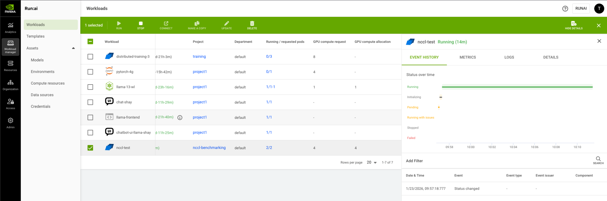

Exec into the container and confirm that all four GPUs are visible:

```bash
runai inference exec nccl-single-node \
  -p "$PROJECT" \
  --tty \
  --stdin \
  -- bash

nvidia-smi
```

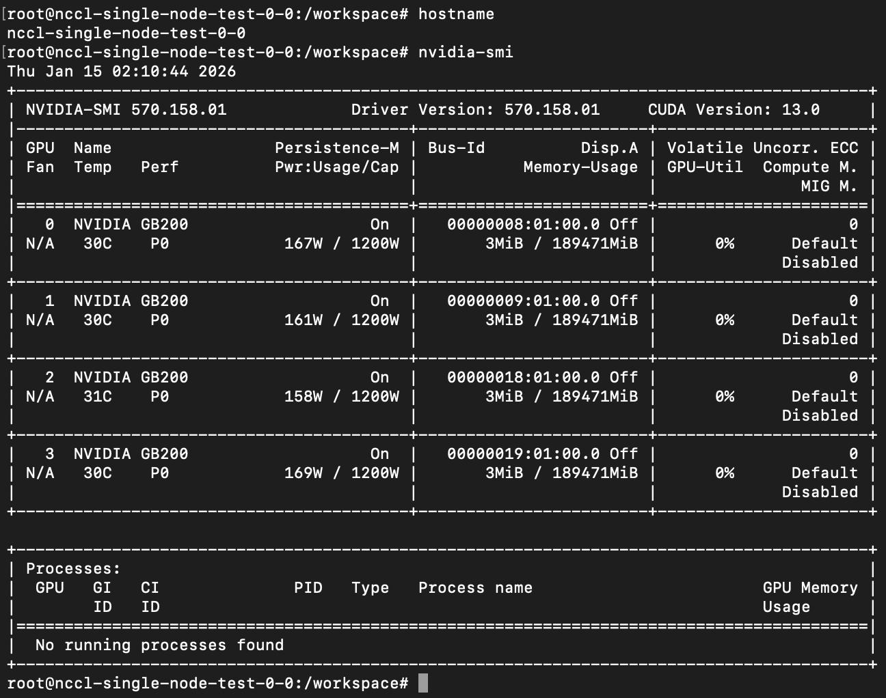

Run the single-node NCCL test:

```bash
mpirun -np 4 \
  --allow-run-as-root \
  -x NCCL_DEBUG=INFO \
  "$NCCL_TEST_BIN" \
  -b 8 -e 1G -f 2 -g 1 -w 2 --iters 10 -c 10
```


Success looks like:

- Four ranks are started.
- All ranks report NVIDIA GB200 devices.
- `Out of bounds values : 0 OK`
- The output includes average bus bandwidth.

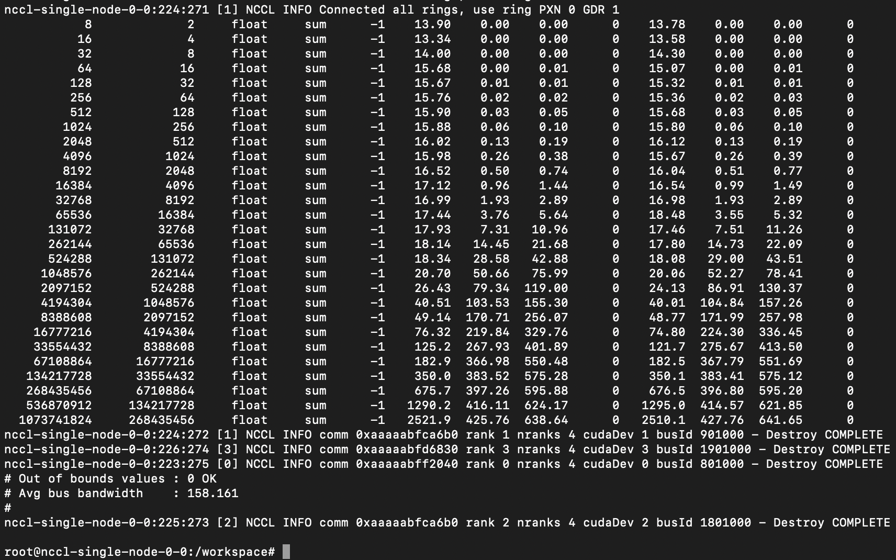

Exit the container shell when the test completes:

```bash
exit
```

## 5. Run NCCL on 2 Nodes x 4 GPUs

Create one distributed inference workload with one leader and one worker. With four GPUs requested per pod, this creates an 8-GPU test target.

```bash
runai inference distributed submit nccl-two-node \
  -p "$PROJECT" \
  -i "$NCCL_IMAGE" \
  --replicas 1 \
  --workers 1 \
  --gpu-devices-request 4 \
  --node-pools "$NODE_POOL" \
  --serving-port 8080 \
  --large-shm \
  --command bash \
  --arguments "-lc 'python3 -m http.server 8080 >/tmp/http.log 2>&1 & sleep infinity'"
```

Monitor the workload and identify pod names:

```bash
runai inference distributed describe nccl-two-node \
  -p "$PROJECT" \
  --pods \
  --compute \
  --pod-limit 20

runai inference distributed list -p "$PROJECT"
```

If you have Kubernetes access, confirm the pod-to-node placement:

```bash
kubectl get pods -n "runai-${PROJECT}" -o wide | grep nccl-two-node
kubectl get nodes -L topology.kubernetes.io/rack
```

Exec into the leader or first worker pod:

```bash
runai inference distributed exec nccl-two-node \
  -p "$PROJECT" \
  --pod <pod-name> \
  --tty \
  --stdin \
  -- bash
```

Create a hostfile. Use pod hostnames or pod IPs that are reachable from inside the container:

```bash
cat >/tmp/nccl-hosts <<'EOF'
<pod-0-hostname-or-ip> slots=4
<pod-1-hostname-or-ip> slots=4
EOF
```

Run the 8-GPU test:

```bash
mpirun -np 8 \
  --allow-run-as-root \
  --hostfile /tmp/nccl-hosts \
  -x NCCL_DEBUG=INFO \
  -x NCCL_SOCKET_IFNAME=eth0 \
  "$NCCL_TEST_BIN" \
  -b 8 -e 1G -f 2 -g 1 -w 2 --iters 10 -c 10
```
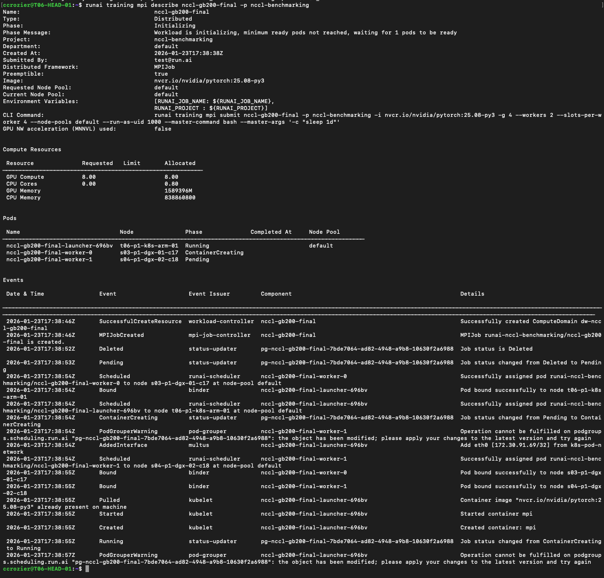

If the test cannot launch ranks on the remote pod, the image is missing the site-required MPI launch setup. Use the site NCCL test image or the MPI-enabled workload pattern approved for the cluster.

## 6. Run NCCL on 3 Nodes x 4 GPUs Across Racks

Create one distributed inference workload with one leader and two workers. With four GPUs requested per pod, this creates a 12-GPU test target.

```bash
runai inference distributed submit nccl-three-node \
  -p "$PROJECT" \
  -i "$NCCL_IMAGE" \
  --replicas 1 \
  --workers 2 \
  --gpu-devices-request 4 \
  --node-pools "$NODE_POOL" \
  --serving-port 8080 \
  --large-shm \
  --command bash \
  --arguments "-lc 'python3 -m http.server 8080 >/tmp/http.log 2>&1 & sleep infinity'"
```

Verify that the pods are running and inspect which nodes they landed on:

```bash
runai inference distributed describe nccl-three-node \
  -p "$PROJECT" \
  --pods \
  --compute \
  --events \
  --pod-limit 20
```

In the UI, open **Workload manager > Workloads** and select the workload to see status, events, metrics, and logs.

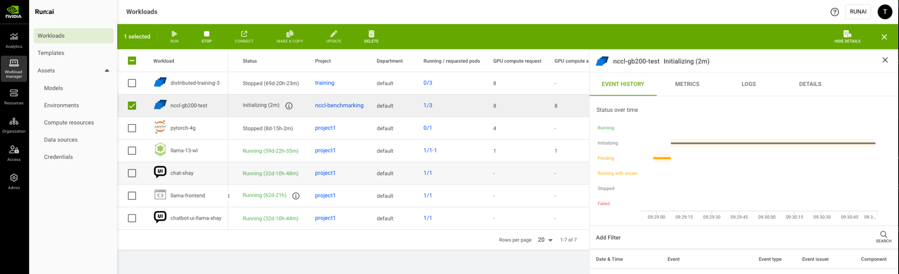

Confirm rack placement:

```bash
kubectl get pods -n "runai-${PROJECT}" -o wide | grep nccl-three-node
kubectl get nodes -L topology.kubernetes.io/rack
```

For a between-rack test, at least two workload pods should be on nodes with different rack labels or rack-identifying names. If all pods land on the same rack, delete and resubmit with node pools, scheduling rules, or excluded nodes appropriate for your environment.

Exec into the leader or first worker pod:

```bash
runai inference distributed exec nccl-three-node \
  -p "$PROJECT" \
  --pod <pod-name> \
  --tty \
  --stdin \
  -- bash
```

Create a hostfile for all three pods:

```bash
cat >/tmp/nccl-hosts <<'EOF'
<pod-0-hostname-or-ip> slots=4
<pod-1-hostname-or-ip> slots=4
<pod-2-hostname-or-ip> slots=4
EOF
```

Run the 12-GPU test:

```bash
mpirun -np 12 \
  --allow-run-as-root \
  --hostfile /tmp/nccl-hosts \
  -x NCCL_DEBUG=INFO \
  -x NCCL_SOCKET_IFNAME=eth0 \
  "$NCCL_TEST_BIN" \
  -b 8 -e 1G -f 2 -g 1 -w 2 --iters 10 -c 10
```

## 7. Verify, Monitor, and Observe

Use these commands while the workloads are running:

```bash
runai workload list
runai inference list -p "$PROJECT"
runai inference distributed list -p "$PROJECT"

runai inference describe nccl-single-node -p "$PROJECT" --pods --events --compute
runai inference distributed describe nccl-two-node -p "$PROJECT" --pods --events --compute --pod-limit 20
runai inference distributed describe nccl-three-node -p "$PROJECT" --pods --events --compute --pod-limit 20

runai inference logs nccl-single-node -p "$PROJECT"
runai inference distributed logs nccl-two-node -p "$PROJECT"
runai inference distributed logs nccl-three-node -p "$PROJECT"
```

Expected NCCL success indicators:

- `NCCL INFO` appears in the output.
- The number of ranks matches the GPU count: 4, 8, or 12.
- Each rank maps to the expected GB200 GPU.
- `Out of bounds values : 0 OK` appears.
- Bandwidth is nonzero and broadly consistent with the expected topology.

## 8. Notes and Pitfalls

- A single-node NCCL test validates GPU visibility and intra-node GPU communication.
- A two-node test validates inter-node communication within the selected topology.
- A three-node test can validate cross-rack behavior when the scheduler places pods across rack boundaries.
- If rack labels are not available, node names or administrator-provided node pool naming may be the only rack indicator.
- `--workers` on distributed inference means additional worker pods in the group. With one leader, `--workers 1` gives two GPU pods, and `--workers 2` gives three GPU pods.
- Multi-node NCCL requires a working MPI launch path across pods. If `mpirun` cannot start remote ranks, fix the image or use the environment's approved MPI workload pattern.
- Keep tests short unless you are intentionally running sustained burn-in validation.

## 9. Cleanup

Delete workloads when testing is complete:

```bash
runai inference delete nccl-single-node -p "$PROJECT"
runai inference distributed delete nccl-two-node -p "$PROJECT"
runai inference distributed delete nccl-three-node -p "$PROJECT"
```

Confirm cleanup:

```bash
runai workload list
runai node list
```
